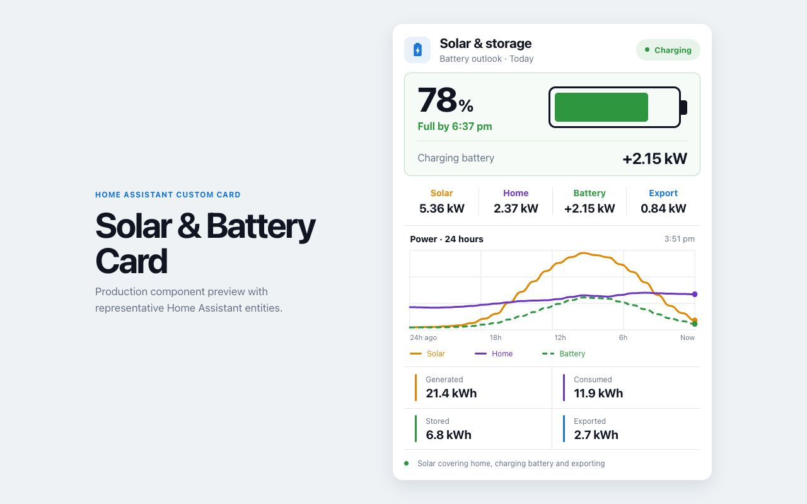

# Solar & Battery Card for Home Assistant

A custom Home Assistant dashboard card focused on solar generation, household
load, battery state, grid flow, and daily energy totals.



## Status

The first production milestone is implemented: a Lit/TypeScript custom card,
native `getConfigForm()` editor schema, entity-driven live values, and 24-hour
history sourced from Home Assistant's history API.

## Features

- Battery state of charge and charging/discharging outlook
- Live solar, home, battery, and grid power in kW
- 24-hour power history
- Daily generated, consumed, stored, imported, and exported energy in kWh
- Native Home Assistant visual configuration using entity selectors
- Responsive dashboard layout
- HACS-compatible packaging

## Proposed configuration

```yaml
type: custom:solar-battery-card
title: Solar & storage
battery_soc: sensor.battery_state_of_charge
solar_power: sensor.solar_power
home_power: sensor.home_power
battery_power: sensor.battery_power
grid_power: sensor.grid_power
solar_energy_today: sensor.solar_energy_today
home_energy_today: sensor.home_energy_today
battery_energy_today: sensor.battery_energy_today
export_energy_today: sensor.grid_export_energy_today
battery_capacity: 27
battery_positive_is_charging: true
grid_positive_is_export: true
show_power_chart: true
```

The first five entity fields are required. Daily energy entities and usable
battery capacity are optional.

## HACS installation

Until the card is accepted into the default HACS catalog:

1. Open HACS in Home Assistant.
2. Open the three-dot menu and select **Custom repositories**.
3. Add `https://github.com/halfbuilthq/solar-battery-card` as a
   **Dashboard** repository.
4. Find **Solar & Battery Card** in HACS and select **Download**.
5. Refresh Home Assistant, then add the card from the dashboard card picker.

After the repository is accepted into the default HACS catalog, search for
**Solar & Battery Card** directly without adding a custom repository.

## Development

```sh
npm install
npm run dev
```

The development server opens a representative Home Assistant state fixture.

Run the complete verification:

```sh
npm run check
```

The production bundle is emitted to `dist/solar-battery-card.js`.

## Manual installation

1. Copy `dist/solar-battery-card.js` to
   `<config>/www/solar-battery-card.js`.
2. Add `/local/solar-battery-card.js` as a JavaScript module dashboard
   resource.
3. Add the card from Home Assistant's card picker and configure its entities
   in the visual editor.

## Sign conventions

The card defaults to positive battery power meaning charging and positive grid
power meaning export. Both conventions can be reversed in the visual editor.
The selected battery convention is applied consistently to the live status and
the 24-hour chart. Charging is plotted above zero and discharging below zero.

## License

[MIT](LICENSE)
